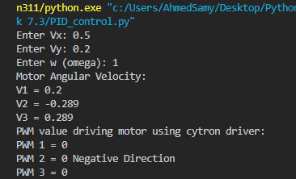

# Kinematic Model Derivation
---
### Resolving
First, we need to resolve the velocity of the three omnidirectional wheels in the X-diretcion and Y-direction.

- `Omega` : Direction of motion between Wheel 1 and positive X-axis.
- `Theta` : Angle between a wheel and the consecuetive wheel is equal 120 degree.
- `Radius` : Distance between center of robot and the wheels is equal 20 cm.
  


`V1`

V<sub>x1</sub> = V<sub>1</sub>.cos( omega + 90)

V<sub>y1</sub> = V<sub>1</sub>.sin( omega + 90)

`V2`

V<sub>x2</sub> = V<sub>2</sub>.cos( omega + 120 + 90)

V<sub>y2</sub> = V<sub>2</sub>.sin( omega + 120 + 90)

`V3`

V<sub>x3</sub> = V<sub>3</sub>.cos( omega + 240 + 90)

V<sub>y3</sub> = V<sub>3</sub>.sin( omega + 240 + 90)

`V Total`

V<sub>xt</sub> = V<sub>1</sub>.cos( omega + 90) + V<sub>2</sub>.cos( omega + 120 + 90) + V<sub>3</sub>.cos( omega + 240 + 90)

V<sub>yt</sub> = V<sub>1</sub>.sin( omega + 90) + V<sub>2</sub>.sin( omega + 120 + 90) + V<sub>3</sub>.sin( omega + 240 + 90)

`Angular Velocity Equation`

V<sub>1</sub> + V<sub>2</sub> + V<sub>3</sub> = R . w

- `Simulation`

`Assumption:` Omega is equal 0.
```
    # Angles between wheels
    theta1 = 0
    theta2 = 120
    theta3 = 240
    # Distance between robot center to wheel
    radius = 0.2
    # Array containing coefficients of V1 & V2 & V3 after resolving in x-direction & y-direction
    arr = np.array(
        [
            [np.cos((theta1 + 90) * (np.pi / 180)), np.cos((theta2 + 90) * (np.pi / 180)),
             np.cos((theta3 + 90) * (np.pi / 180))],
            [np.sin((theta1 + 90) * (np.pi / 180)), np.sin((theta2 + 90) * (np.pi / 180)),
             np.sin((theta3 + 90) * (np.pi / 180))],
            [1 / radius, 1 / radius, 1 / radius]
        ]
    )
```
### Writing Equation in Matrix Form
```math
\begin{bmatrix}V<sub>x</sub> \\ V<sub>y</sub> \\ w\end{bmatrix}
=
\begin{bmatrix} cos(90)&cos(210)&cos(330) \\ sin(90)&sin(210)&sin(330) \\ 1 \over R&1 \over R&1 \over R\end{bmatrix}
*
\begin{bmatrix}V<sub>1</sub> \\ V<sub>2</sub> \\ V<sub>3</sub>\end{bmatrix}
```
To Calculate V<sub>1</sub>, V<sub>2</sub> and V<sub>3</sub>:
1. Get Inverse Matrix of the 3x3 Square Matrix.

Matrix
```math
\begin{bmatrix} 0&- \sqrt{3} \over 2& \sqrt{3} \over 2 \\ 1&-1 \over 2&-1 \over 2 \\5&5&5\end{bmatrix}
```
Inverse
```math
\begin{bmatrix} -3.2*10^-17&0.667&0.0667\\ -0.577&-0.333&0.0667\\0.577&-0.333&0.0667\end{bmatrix}
```
2. Multiply Inverse Matrix by the Column Vector containing V<sub>x</sub>, V<sub>y</sub>, w.
```math
\begin{bmatrix}V<sub>1</sub> \\ V<sub>2</sub> \\ V<sub>3</sub>\end{bmatrix}
=
\begin{bmatrix} -3.2*10^-17&0.667&0.0667\\ -0.577&-0.333&0.0667\\0.577&-0.333&0.0667\end{bmatrix}
*
\begin{bmatrix}V<sub>x</sub> \\ V<sub>y</sub> \\ w\end{bmatrix}
```
- `Simulation`
```
    # multiplying a 3x3 array (coefficients inverse matrix) & 3x1 array (input by user) to obtain V1, V2, V3
    v1, v2, v3 = np.matmul(np.linalg.pinv(arr), velocity)
```
